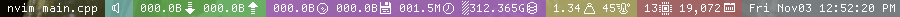

# StBar
a C++ status bar application for Linux That aims to be fast and light through GPU rendering.

## Features
- **X11**: Utilizes the X11 API for drawing and managing windows with minimal overhead.
- **OpenGL**: Utilizes the GPU for rendering and calculations, reducing CPU usage.
- **JSON Configuration**: The font used for rendering can be easily swapped or changed through JSON without the need for rebuilding.
- **Texture Rendering**: The program uses a tileset from a texture to render the font quickly.

**Dependencies**
- nlohmann JSON Library: Used for handling JSON configuration files.
- Tamzen Font (converted to PNG): Provides bitmap font for rednering.

## Installation

  Clone this repository:
    
    git clone https://github.com/kapypara/stbar

  Build the application:

    mkdir build && cd build
    cmake ..
    make

Run the application:

    ./stbar_v4

## Contributing
Contributions to this project are welcome. Feel free to submit issues, create pull requests, or suggest improvements.

## License
This project is licensed under the MIT License. See the LICENSE file for details.

## Contact
For questions, feedback, or support, please contact [Kapy](mailto:kapy@badinfo.xyz).
